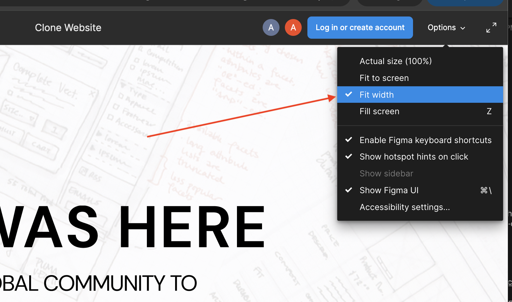
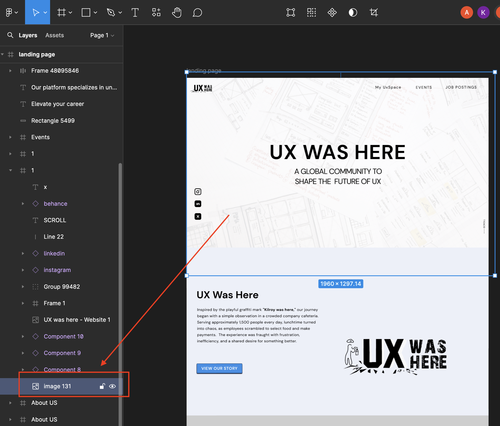
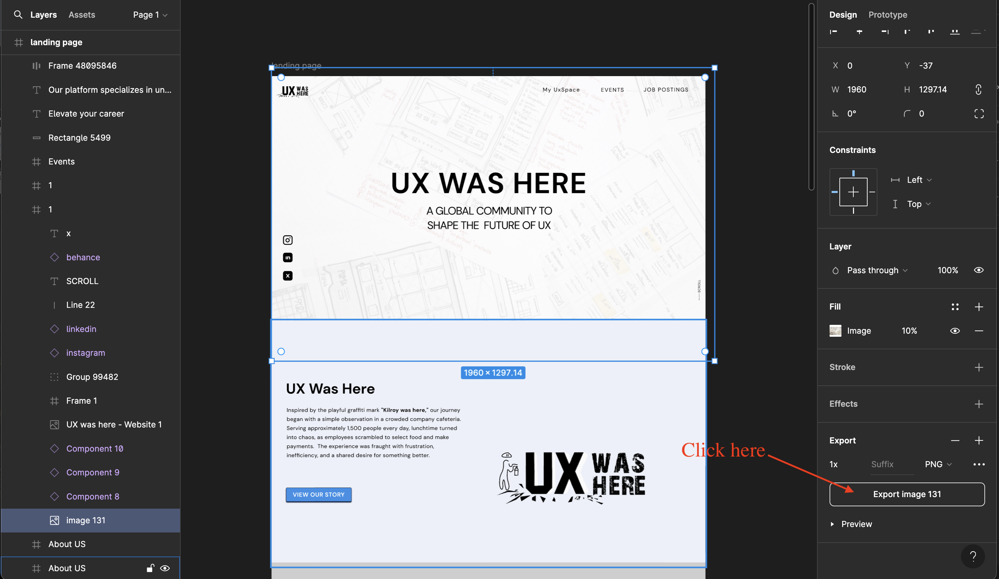

## OPTIONAL Assignment

The goal of this assignment is to mimic the tasks you would do in a real company setting and to get you familiar with Figma. In a company, if you work as a developer, you will be given a detailed mockup design, ideally in Figma, and you have to replicate that design into an actual website.

Since it's just practice, you do not have to worry about responsiveness, though it would look nice on your resume/projects if the website is responsive.

[This is the link to the Figma design prototype](https://www.figma.com/proto/Rr2iKpvW4uNPXTKuEq6hGF/Clone-Website?node-id=0-1&t=0eNvtD03pB74r94V-1)

> Remember to click on the "Fit Width" as shown below to view in full-screen mode.

<u>That is the website you have to clone.</u> 
Notice how you cannot inspect this prototype; this is because it is not an actual website but rather a prototype made using Figma.

[However, if you need to check how the prototype is made, you can click on this link to open up the prototype workspace:](https://www.figma.com/design/Rr2iKpvW4uNPXTKuEq6hGF/Clone-Website?node-id=0-1&t=0eNvtD03pB74r94V-1)

> PLEASE DO NOT CHANGE THE PROTOTYPE 
> as others will also use this workspace. 
> Only download assets as needed.

## To download an asset from the Figma workspace:
* Click on the image.
* If you cannot find the image, you have to select it from the sidebar as shown below:

* Once you select an image (or an asset), you can download it by clicking on the "Export" button on the right sidebar as shown below:

[You can also watch the full tutorial on how to download an asset from here](https://www.guvi.in/blog/steps-to-download-an-image-from-figma/#:~:text=You%20will%20find%20the%20'Export,%2C%20PDF%2C%20etc.)

## Other Non-Functional Requirements:
* Use SASS for the stylesheet.
* Semantic HTML.
* Readable file structures and code.

## 
There is no deadline for this assignment, its just for practice. 
